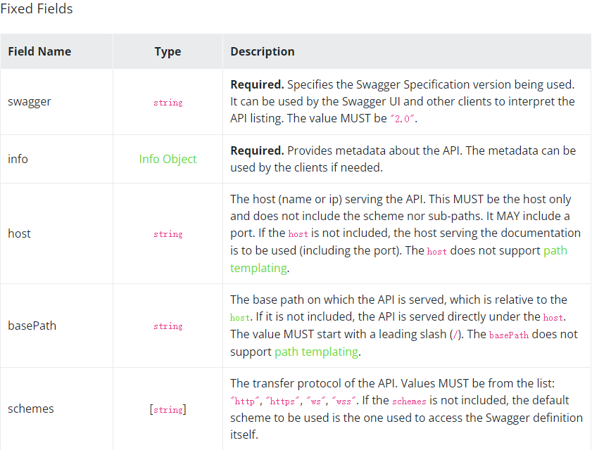
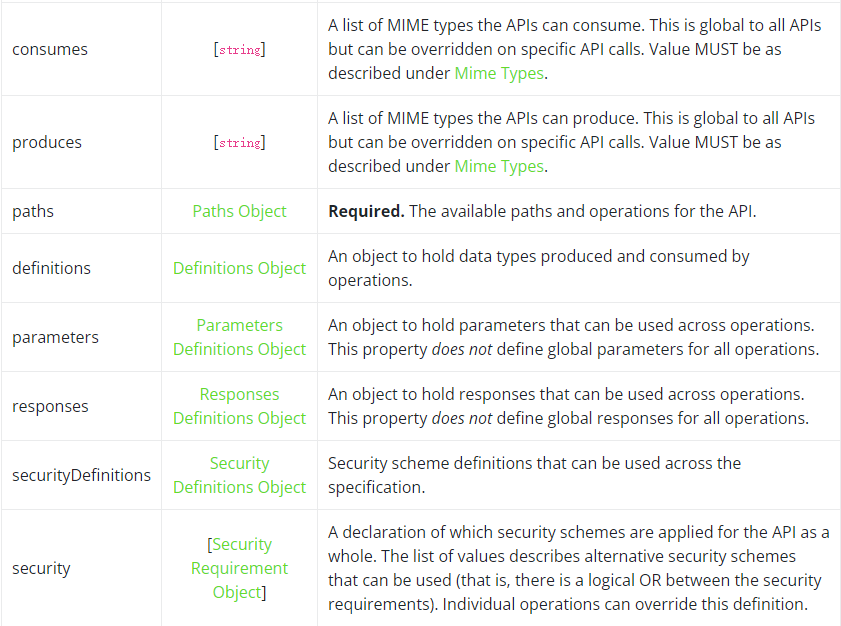
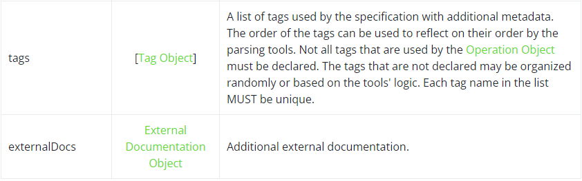

### Swagger Object

This is the root document object for the API specification. It combines what previously was the Resource Listing and API Declaration (version 1.2 and earlier) together into one document.

